# <p align="center"> CineChoice - E-Commerce App </p>


## Overview
**This application offers various features to enhance your movie-watching experience. Users can easily find their favorite films and add movies to their favorites. Additionally, with a user-friendly interface, they can access movie details and quickly find desired films using the in-app search feature. The app aims to help users manage their film preferences more effectively.**


## 📸 Screenshots
<table>
    <tr>
        <td align="center">
            <strong><h2>Splash Screen</h2></strong>
            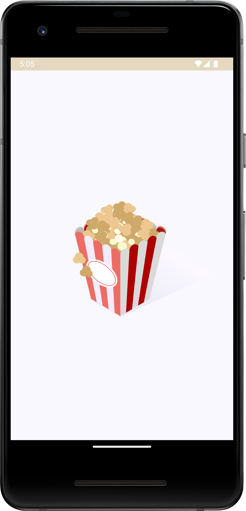
        </td>
        <td align="center">
            <strong><h2>Register Screen</h2></strong>
            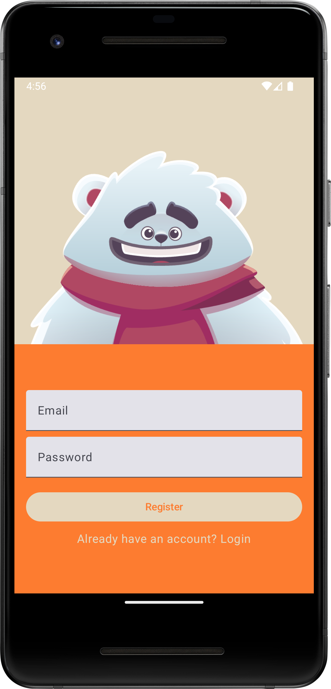
        </td>
        <td align="center">
            <strong><h2>Login Screen</h2></strong>
            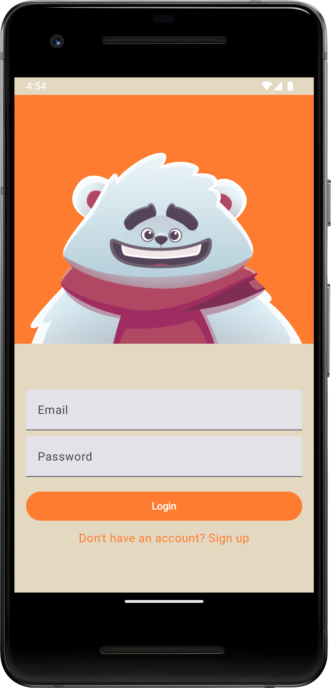
        </td>
    </tr>
    <tr>
        <td align="center">
            <strong><h2>Welcome Onboarding</h2></strong>
            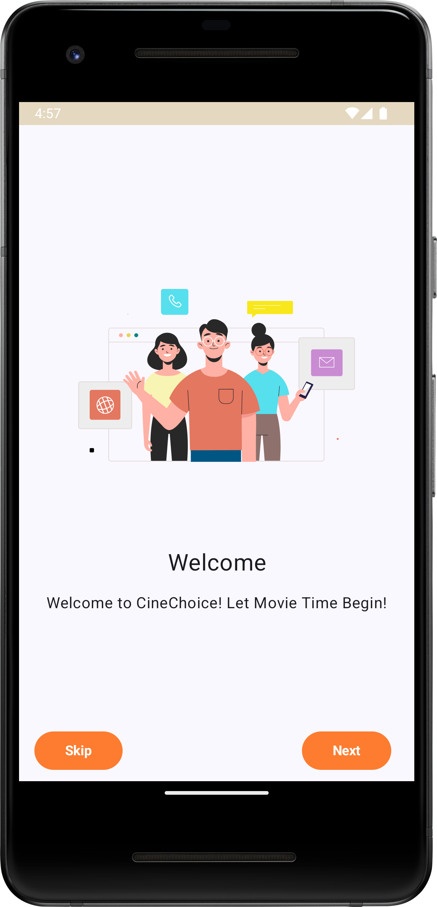
        </td>
        <td align="center">
            <strong><h2>Explore Onboarding</h2></strong>
            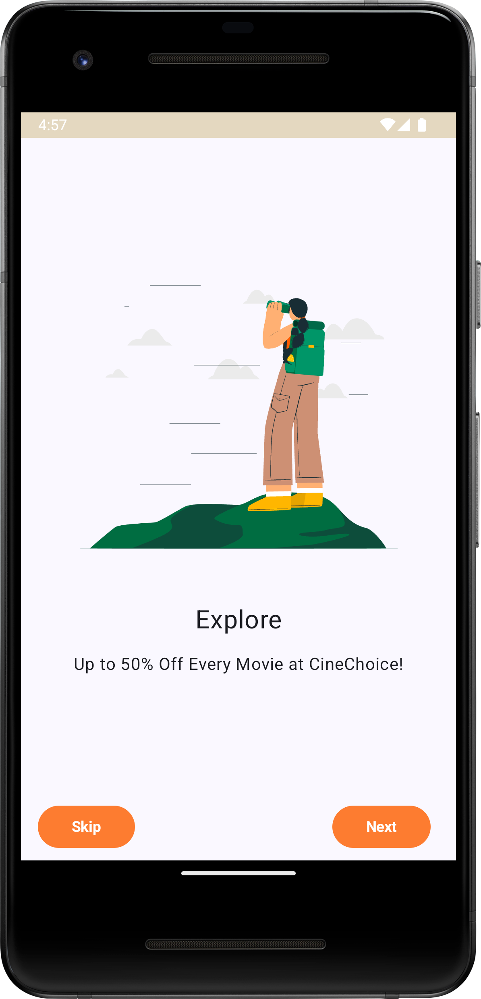
        </td>
        <td align="center">
            <strong><h2>Strat Onboarding</h2></strong>
            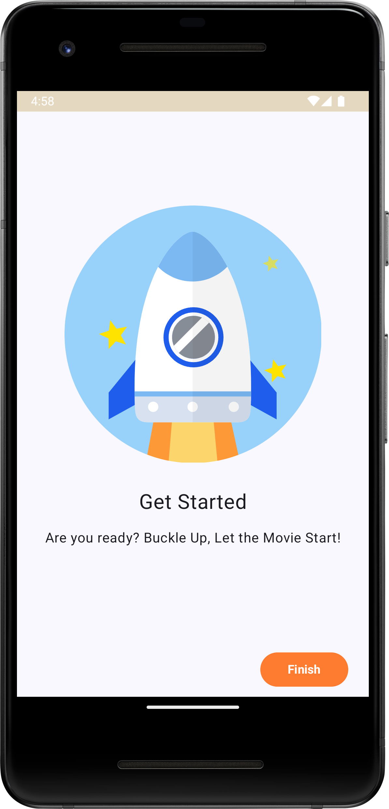
        </td>
    </tr>
    <tr>
        <td align="center">
            <strong><h2>Home Screen 1</h2></strong>
            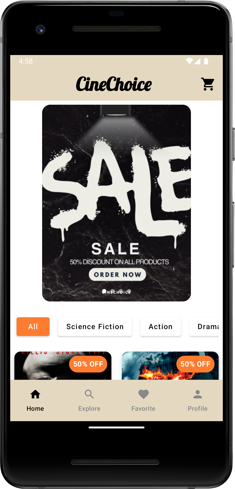
        </td>
        <td align="center">
            <strong><h2>Home Screen 2</h2></strong>
            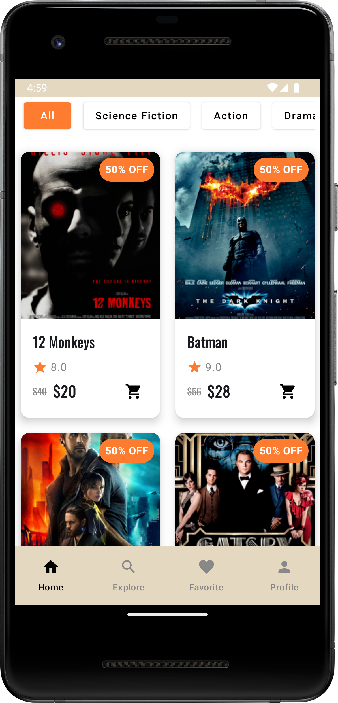
        </td>
        <td align="center">
            <strong><h2>Explore Screen</h2></strong>
            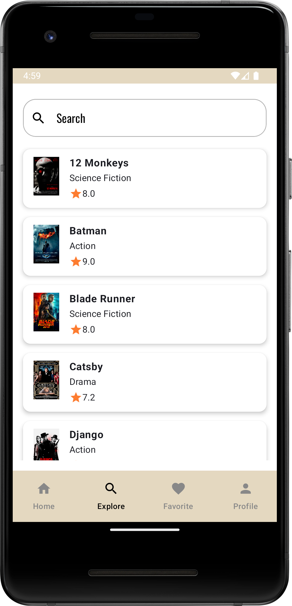
        </td>
    </tr>
    <tr>
        <td align="center">
            <strong><h2>Favorite Screen</h2></strong>
            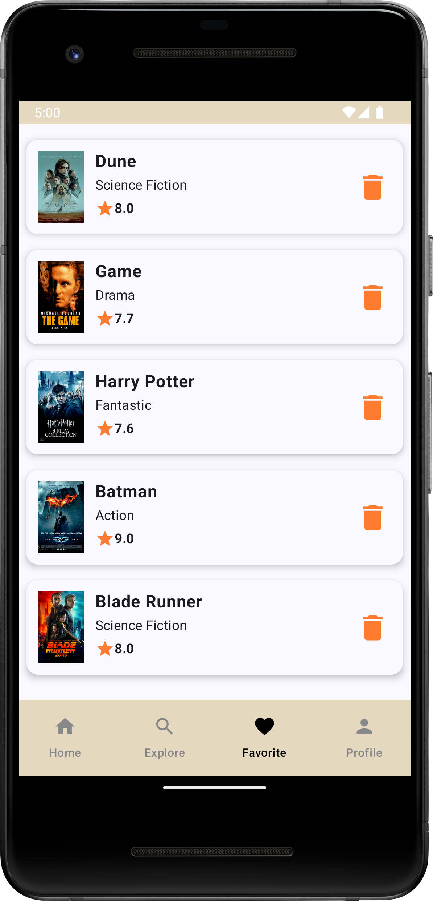
        </td>
        <td align="center">
            <strong><h2>Profile Screen</h2></strong>
            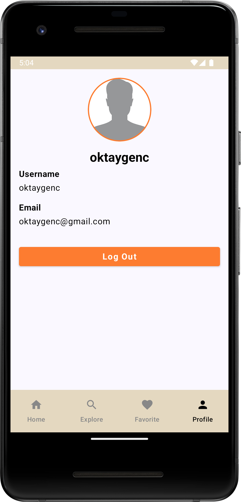
        </td>
        <td align="center">
            <strong><h2>Detail Screen</h2></strong>
            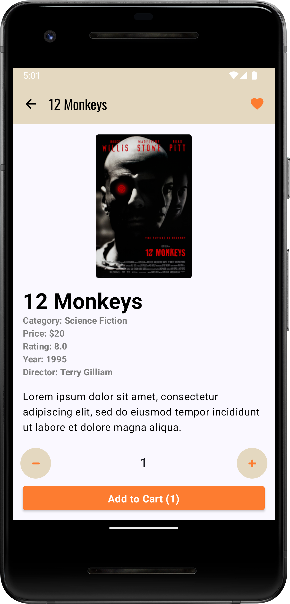
        </td>
    </tr>
    <tr>
        <td align="center">
            <strong><h2>Cart Screen</h2></strong>
            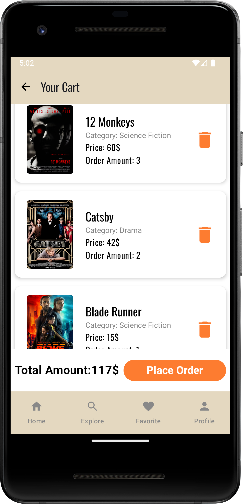
        </td>   
    </tr>
</table>


## :point_down: Structures Used

- **Android Gradle Plugin (AGP) 8.8.0**  
- **MVVM + Clean Architecture**  
- **Kotlin 2.1.0**
- **KSP** (Kotlin Symbol Processing API)
- **Jetpack Compose**  
- **Coil** (Image loading library)  
- **Retrofit** (HTTP client)  
- **Gson** (JSON serialization/deserialization)  
- **Dagger Hilt** (Dependency injection)  
- **Firebase** (Firebase Auth and Firestore)  
- **Lottie** (Animation library)  
- **Landscapist** (Image loading with Glide)  
- **Rive** (Animation library)  
- **Navigation Component** (Navigation support)  
- **LiveData** (Data observation)  
- **ViewModel** (For MVVM architecture)  
- **Coroutines** (Asynchronous programming)  
- **Flow** (Reactive programming)  
- **Material Design** (UI components)


  ## ✨ Application Features

- **Splash Screen:** Provides a pleasant welcome to the user upon application launch.  
- **Onboarding:** A guided introduction to help users understand the app's functionalities.  
- **Login and Register:** Secure user authentication for personalized experiences.  
- **Add to Cart Movie:** Users can easily add movies to a virtual cart for convenient access.  
- **Remove from Movie Cart:** Users can remove movies from their cart if they change their mind.  
- **Add to Favorites:** Allows users to mark movies as favorites for quick access later.  
- **User Profile:** A section where users can manage their account details and preferences.  
- **Search Functionality:** Users can quickly find movies by title, genre, or actor.  
- **Movie Detail Page:** Offers detailed information about each movie, including synopsis, cast, reviews, and ratings.  
- **User-Friendly Interface:** Enhances user experience with a modern and intuitive design.


## :pencil2: Dependencies

app build.gradle

```
plugins {
    alias(libs.plugins.android.application)
    alias(libs.plugins.kotlin.android)
    alias(libs.plugins.kotlin.compose)
    alias(libs.plugins.hilt.plugin)
    alias(libs.plugins.ksp.plugin)
    alias(libs.plugins.google.gms.google.services)
}

android {
    namespace = "com.oktaygenc.cinechoice"
    compileSdk = 35

    defaultConfig {
        applicationId = "com.oktaygenc.cinechoice"
        minSdk = 26
        targetSdk = 35
        versionCode = 1
        versionName = "1.0"

        testInstrumentationRunner = "androidx.test.runner.AndroidJUnitRunner"
    }

    buildTypes {
        release {
            isMinifyEnabled = false
            proguardFiles(
                getDefaultProguardFile("proguard-android-optimize.txt"),
                "proguard-rules.pro"
            )
        }
    }
    compileOptions {
        sourceCompatibility = JavaVersion.VERSION_11
        targetCompatibility = JavaVersion.VERSION_11
    }
    kotlinOptions {
        jvmTarget = "11"
    }
    buildFeatures {
        compose = true
    }
}

dependencies {

    implementation(libs.androidx.core.ktx)
    implementation(libs.androidx.lifecycle.runtime.ktx)
    implementation(libs.androidx.activity.compose)
    implementation(platform(libs.androidx.compose.bom))
    implementation(libs.androidx.ui)
    implementation(libs.androidx.ui.graphics)
    implementation(libs.androidx.ui.tooling.preview)
    implementation(libs.androidx.material3)
    implementation(libs.firebase.auth)
    implementation(libs.firebase.firestore)
    testImplementation(libs.junit)
    androidTestImplementation(libs.androidx.junit)
    androidTestImplementation(libs.androidx.espresso.core)
    androidTestImplementation(platform(libs.androidx.compose.bom))
    androidTestImplementation(libs.androidx.ui.test.junit4)
    debugImplementation(libs.androidx.ui.tooling)
    debugImplementation(libs.androidx.ui.test.manifest)

    // Navigation
    implementation(libs.androidx.navigation.compose)
    implementation (libs.material3)
    implementation (libs.gson)
    implementation(libs.androidx.material)

    // Viewmodel and Live Data
    implementation(libs.androidx.lifecycle.viewmodel)
    implementation(libs.androidx.activity.ktx)
    implementation(libs.androidx.runtime.livedata)

    // Dagger-Hilt
    implementation(libs.hilt.android)
    ksp(libs.hilt.android.compiler)
    implementation(libs.androidx.hilt.navigation.compose)

    // Retrofit
    implementation(libs.retrofit)
    implementation(libs.converter.gson)

    // Glide
    implementation(libs.landscapist.glide)

    // Lottie Animations
    implementation (libs.lottie.compose)

    //Coil
    implementation(libs.coil.compose)
    implementation(libs.coil.network.okhttp)

    // Foundation
    implementation (libs.androidx.foundation)

    //Rive Animation
    implementation(libs.rive)
    implementation(libs.startup)


}

```


project build.gradle

```
plugins {
    alias(libs.plugins.android.application) apply false
    alias(libs.plugins.kotlin.android) apply false
    alias(libs.plugins.kotlin.compose) apply false
    alias(libs.plugins.hilt.plugin) apply false
    alias(libs.plugins.ksp.plugin) apply false
    alias(libs.plugins.google.gms.google.services) apply false
}
```
